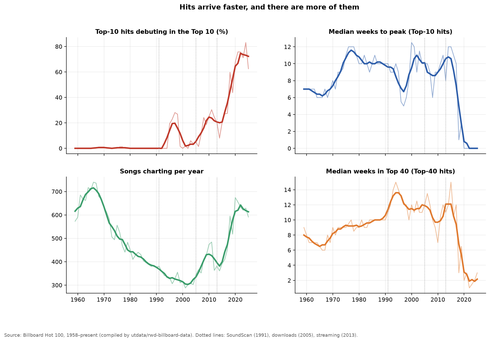
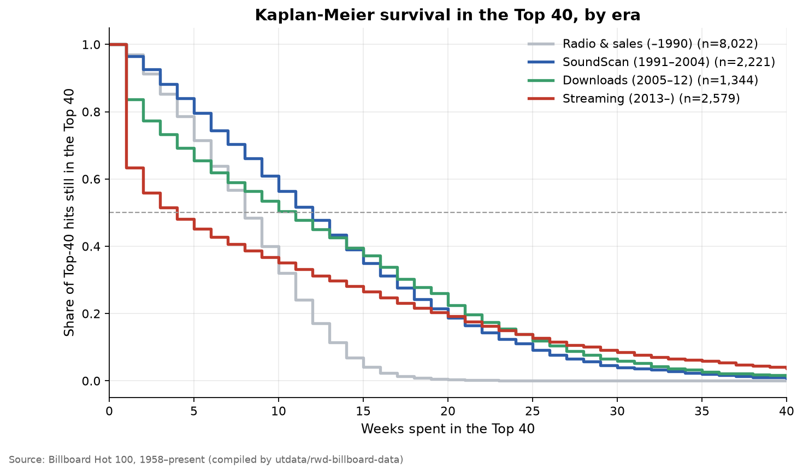
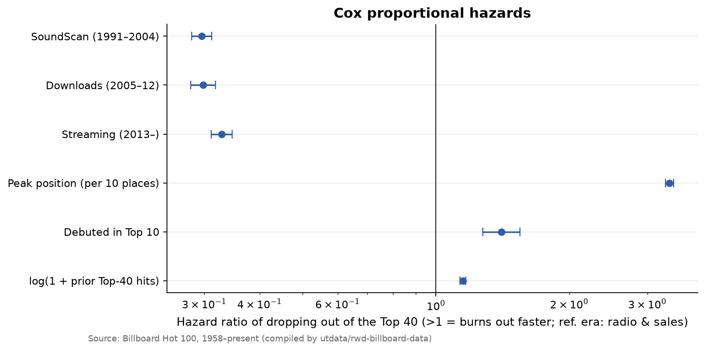
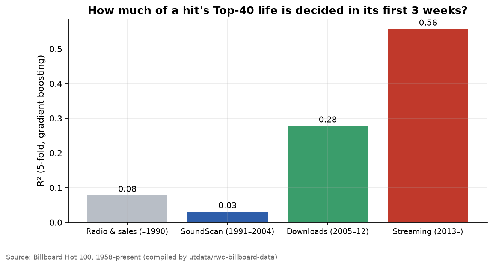

# The Half-Life of a Hit: Are Songs Burning Out Faster in the Streaming Era?

A common complaint is that songs "don't last anymore": streaming turns hits into disposable, week-long events. This repo tests that with every Billboard Hot 100 chart since August 1958, about 30,000 songs. It treats a hit's time on the chart as a **survival problem**. The question is what raises the "hazard" of a song dropping out, and whether the streaming era changed it.

Charts are a market for attention with measurable entry, peak and exit. The same tools economists use for unemployment spells or firm survival apply directly.

## Data
Weekly Billboard Hot 100 positions, 1958 to latest ([utdata/rwd-billboard-data](https://github.com/utdata/rwd-billboard-data)), pulled fresh on every run and collapsed to one row per song (title × performer):
debut date and position, peak, weeks to peak, total weeks, weeks in the Top 40, positions in weeks 1–3, and the artist's number of earlier Top-40 hits.

**Eras** follow changes in how Billboard measures popularity:

| Era | Years | What changed |
|---|---|---|
| Radio & sales | 1958–1990 | Reported sales and radio playlists |
| SoundScan | 1991–2004 | Point-of-sale scanning and monitored airplay |
| Downloads | 2005–2012 | Digital track sales counted |
| Streaming | 2013– | On-demand and YouTube streams counted |

## Method
1. **Front-loading.** Yearly share of Top-10 hits that *debut* in the Top 10, median weeks from debut to peak, and chart turnover.
2. **Kaplan-Meier survival curves** of weeks in the Top 40 by era. Songs still on the chart are treated as right-censored.
3. **Cox proportional hazards** for leaving the Top 40, controlling for peak position, a Top-10 debut and the artist's track record. This separates "songs burn out faster" from "the chart now admits more songs that were never going to last".
4. **Machine learning.** A gradient-boosting model predicts a song's total Top-40 life from its first three chart positions. Its out-of-fold R² in each era measures how much of a hit's fate is decided at launch.

## Results
<!-- RESULTS:START -->
_Auto-generated by `run.py` on 2026-09-25. Numbers refresh whenever the pipeline re-runs._

### Headline numbers

- Top-10 hits that **debuted** in the Top 10: **0%** (1960–89 avg) → **56%** (2015+ avg).
- Median weeks from debut to peak for Top-10 hits: **8.9 → 3.4**.
- Songs charting per year: **542 → 561**.
- Median Top-40 life (Kaplan-Meier): **8 weeks** in the Radio & sales (–1990) era vs **4 weeks** in the Streaming (2013–) era.
- **One-week wonders:** 3% of Top-40 entries lasted a single week in the Radio & sales (–1990) era vs **37%** in the Streaming (2013–) era, yet **20%** of streaming-era Top-40 hits stay 20+ weeks (vs 0%). The chart has polarised into flash debuts and long-runners.
- Cox model: holding peak, debut and artist track record fixed, a streaming-era hit's hazard of leaving the Top 40 is **0.33×** the radio-era baseline (95% CI 0.31–0.35).
- Share of Top-40 life predictable from the first three weeks: R² **0.08** (Radio & sales (–1990)) → **0.56** (Streaming (2013–)).

### Cox proportional hazards (leaving the Top 40)

| Variable | Hazard ratio | 95% CI low | 95% CI high | p |
|---|---|---|---|---|
| SoundScan (1991–2004) | 0.296 | 0.281 | 0.312 | 0.000 |
| Downloads (2005–12) | 0.298 | 0.280 | 0.318 | 0.000 |
| Streaming (2013–) | 0.329 | 0.311 | 0.347 | 0.000 |
| Peak position (per 10 places) | 3.366 | 3.295 | 3.439 | 0.000 |
| Debuted in Top 10 | 1.404 | 1.276 | 1.546 | 0.000 |
| log(1 + prior Top-40 hits) | 1.151 | 1.132 | 1.169 | 0.000 |

### Predictability by era

| Era | Songs | Out-of-fold R² |
|---|---|---|
| Radio & sales (–1990) | 8019 | 0.078 |
| SoundScan (1991–2004) | 2221 | 0.031 |
| Downloads (2005–12) | 1344 | 0.278 |
| Streaming (2013–) | 2574 | 0.558 |

### Figures

**Front-loading over time**



**Survival in the Top 40**



**Cox hazard ratios**



**Predictability from the first 3 weeks**



<!-- RESULTS:END -->

### What it means
- **The chart has polarised.** Streaming did not make every song shorter-lived. It split the Top 40 into **flash debuts** and **long-runners**. Over a third of streaming-era Top-40 entries last a single week: album tracks that spike when an album drops. The songs that stick stay far longer than hits ever did before 1991.
- That is why the raw median Top-40 life fell by half while the Cox model, which holds peak position fixed, says a streaming-era hit is *less* likely to drop out in any given week than a radio-era hit. Both are true. The average is misleading because the mix of songs changed.
- **Hits now peak on arrival.** Most Top-10 hits debut in the Top 10, and the median weeks-to-peak for Top-10 hits has fallen from about 9 before 1990 to zero since 2020. Promotion now happens *before* release (pre-saves, teasers, social media), not through weeks of radio rotation.
- **A song's fate is increasingly decided in week one.** The first three weeks explain about half of a streaming-era hit's Top-40 life, against under a tenth before 1991.

## Reproduce
```bash
pip install -r requirements.txt
python run.py
```
The GitHub Action re-runs everything on push and monthly as new charts are published.

## Limitations
- Billboard's **recurrent rules** (since 1991, songs below certain positions are removed after 20 or 52 weeks) cap long Hot 100 runs. That is why the survival analysis uses Top-40 time, which the rules affect far less.
- Songs are identified by title × performer, so re-releases and credit changes (e.g. "featuring") can split or merge songs.
- Era boundaries are single years, whereas real changes rolled out gradually.

## References
- Kiefer, N. (1988). *Economic duration data and hazard functions.* Journal of Economic Literature.
- Salganik, M., Dodds, P. & Watts, D. (2006). *Experimental study of inequality and unpredictability in an artificial cultural market.* Science.
